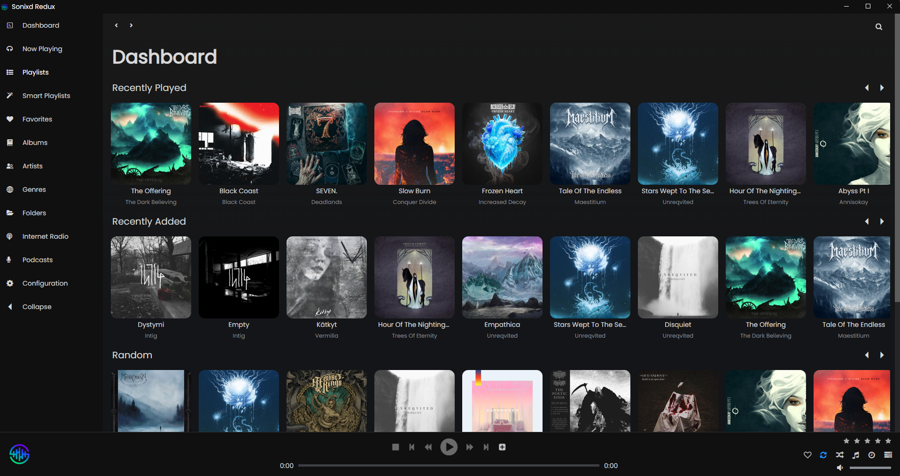
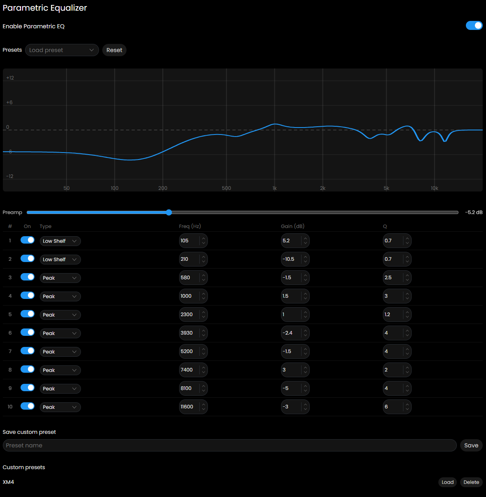

<p align="center">
  
</p>

<h1 align="center">Sonixd Redux</h1>

<p align="center">
  <a href="https://github.com/joffrey-b/Sonixd-Redux/releases"></a>
  <a href="https://github.com/joffrey-b/Sonixd-Redux/blob/main/LICENSE"></a>
  <a href="https://github.com/joffrey-b/Sonixd-Redux/releases"></a>
</p>

A feature-rich desktop music player for [Subsonic](http://www.subsonic.org/) and [Jellyfin](https://jellyfin.org/) media servers.

Sonixd Redux is a fork of [Sonixd](https://github.com/jeffvli/sonixd) by jeffvli, extended with new features while keeping the same look and feel.

<p align="center">
  
</p>

<table align="center"><tr>
  <td></td>
  <td></td>
</tr></table>

<p align="center">
  
</p>

---

## Features

### New in Sonixd Redux

- **MPV backend** - true gapless playback, ReplayGain, audio device selection, and EQ support via [MPV](https://mpv.io/)
- **Graphic EQ** - 10-band graphic equalizer
- **Parametric EQ** - 10-band PEQ with per-band type, frequency, gain, and Q controls, with a live frequency response curve
- **EQ preamp** - preamp control for both the graphic EQ and parametric EQ
- **Custom EQ/PEQ presets** - save, load, and delete named presets
- **Spectrogram** - full-track spectrogram with frequency, time, and dB axes
- **Internet Radio** - play internet radio stations configured on your server directly from the sidebar (Subsonic / Navidrome only)
- **Artist Radio** - one-click similar-artist mix from any artist page, powered by your server's similarity data (Navidrome) or InstantMix (Jellyfin)
- **Smart Playlists** - rule-based playlists filtered by genre, year, play count, rating, starred status, and duration, with sort and limit controls; save to server as a static playlist snapshot
- **Library Cache** - sync your full library locally so Smart Playlists filter against every song, not just a random pool; play count, starred status, and rating stay up to date automatically
- **Scrobble threshold** - configure what percentage of a track must be played before it is scrobbled
- **Lyrics support** - Synced and unsynced lyrics support with "click on text" and zoom function
- **Discord RPC** - now shows album images, retrieved from iTunes
- **Sleep timer** - stop playback after a set duration, or after the current playing song
- **Customizable keyboard shortcuts** - rebind any shortcut, with optional global (unfocused window) support
- **Settings backup/restore** - export and import your settings as JSON
- **Non-intrusive update notifications** - notified on launch when a new version is available

### From Sonixd

- Subsonic and Jellyfin API support
- Music library: albums, artists, genres, songs, folders, playlists
- Web audio player with crossfade and simulated gapless playback
- Cache for image and songs
- Queue management: shuffle, repeat, play next/later, drag & drop reordering
- Favorites, ratings, play counts
- Discord Rich Presence
- OBS integration
- Mini-player
- Multiple themes
- Layout customization
- Track filtering
- System tray options (minimize / exit to tray)
- Global media hotkeys
- 9 languages supported

---

## Requirements

- **Sonixd Redux**: Windows, macOS, or Linux
- **MPV backend** (optional): [MPV](https://mpv.io/) installed on your system
  - Windows: `winget install shinchiro.mpv`
  - Linux: `apt install mpv` / `dnf install mpv` / `pacman -S mpv`
  - macOS: `brew install mpv`

---

## Installation

Download the latest release for your platform from the [Releases](https://github.com/joffrey-b/Sonixd-Redux/releases) page.

| Platform      | Format                 |
| ------------- | ---------------------- |
| Windows x64   | `.exe`                 |
| macOS x64/arm | `.dmg`                 |
| Linux x64/arm | `.AppImage`, `.tar.xz` |

---

## Building from source

```bash
# Install dependencies
yarn install

# Start in development mode
yarn start

# Build for your platform
yarn package
```

---

## Documentation

Full documentation is available at **[joffrey-b.github.io/Sonixd-Redux](https://joffrey-b.github.io/Sonixd-Redux/)**, covering:

- [Getting Started](https://joffrey-b.github.io/Sonixd-Redux/getting-started)
- [Playback](https://joffrey-b.github.io/Sonixd-Redux/playback)
- [MPV Backend](https://joffrey-b.github.io/Sonixd-Redux/mpv-backend)
- [Equalizer & PEQ](https://joffrey-b.github.io/Sonixd-Redux/equalizer)
- [Library](https://joffrey-b.github.io/Sonixd-Redux/library)
- [Internet Radio](https://joffrey-b.github.io/Sonixd-Redux/internet-radio)
- [Artist Radio](https://joffrey-b.github.io/Sonixd-Redux/artist-radio)
- [Smart Playlists](https://joffrey-b.github.io/Sonixd-Redux/smart-playlists)
- [Lyrics](https://joffrey-b.github.io/Sonixd-Redux/lyrics)
- [Scrobbling](https://joffrey-b.github.io/Sonixd-Redux/scrobbling)
- [Sleep Timer](https://joffrey-b.github.io/Sonixd-Redux/sleep-timer)
- [Spectrogram](https://joffrey-b.github.io/Sonixd-Redux/spectrogram)
- [Keyboard Shortcuts](https://joffrey-b.github.io/Sonixd-Redux/keyboard-shortcuts)
- [Settings Reference](https://joffrey-b.github.io/Sonixd-Redux/settings)

---

## License

Sonixd Redux is licensed under the [GNU General Public License v3.0](LICENSE).

It is based on [Sonixd](https://github.com/jeffvli/sonixd) by [jeffvli](https://github.com/jeffvli), also licensed under GPL-3.0.
