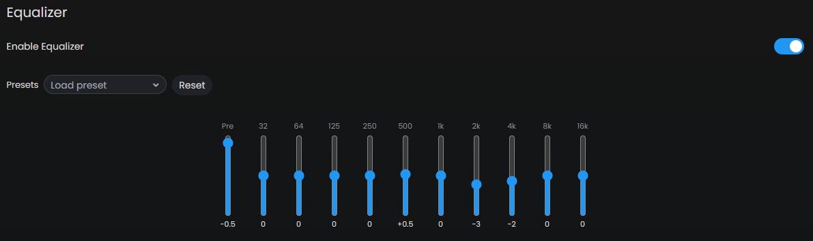
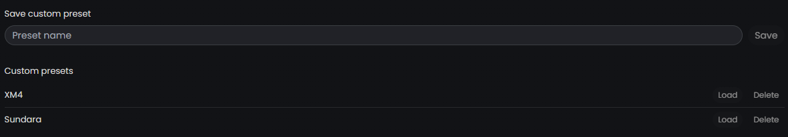

# Equalizer

Sonixd Redux has two equalizers available in **Settings → Equalizer**: a 10-band graphic EQ and a 10-band parametric EQ. Both work with the Web and MPV backends.

---

## Graphic EQ

A classic 10-band equalizer with fixed frequencies.

- **Enable Equalizer** - toggle the graphic EQ on or off
- **Preamp** - global gain applied before the EQ bands (-20 dB to +20 dB). Use this to avoid clipping when boosting bands.
- **Bands** - drag each slider to boost or cut at that frequency (±20 dB)

### Bands

| Band | Frequency |
| ---- | --------- |
| 1    | 32 Hz     |
| 2    | 64 Hz     |
| 3    | 125 Hz    |
| 4    | 250 Hz    |
| 5    | 500 Hz    |
| 6    | 1 kHz     |
| 7    | 2 kHz     |
| 8    | 4 kHz     |
| 9    | 8 kHz     |
| 10   | 16 kHz    |

---

## Parametric EQ (PEQ)

A 10-band parametric equalizer giving full control over each band.

- **Enable Parametric EQ** - toggle the PEQ on or off
- **Preamp** - same as graphic EQ preamp, applied before the PEQ bands
- The frequency response curve shows the combined shape of all active bands

### Per-band controls

| Control   | Description                                              |
| --------- | -------------------------------------------------------- |
| On/Off    | Enable or disable this band individually                 |
| Type      | Filter type (see below)                                  |
| Freq (Hz) | Center or cutoff frequency (20–20000 Hz)                 |
| Gain (dB) | Boost or cut in dB (not used for lowpass/highpass/notch) |
| Q         | Bandwidth - higher Q = narrower filter (0.1–16)          |

### Filter types

| Type       | Description                                      |
| ---------- | ------------------------------------------------ |
| Peaking    | Bell-shaped boost or cut at the center frequency |
| Low Shelf  | Boost or cut everything below the frequency      |
| High Shelf | Boost or cut everything above the frequency      |
| Low Pass   | Cuts frequencies above the cutoff                |
| High Pass  | Cuts frequencies below the cutoff                |
| Notch      | Narrow cut at the center frequency               |

---

## Presets

Both EQs support custom presets.

- **Save custom preset** - enter a name and save your current EQ settings
- **Load preset** - apply a saved preset
- **Delete preset** - remove a saved preset

Presets are saved locally and persist across sessions.

---

## Tips

- Use the **preamp** to prevent clipping when heavily boosting bands - pull it down by the same amount as your largest boost.
- Use **Peaking** bands for surgical cuts to problem frequencies.
- Use **Low Shelf / High Shelf** for broad tonal shaping (more bass, brighter highs).
- The **Q** value controls how wide or narrow the effect is - a Q of 1.4 is a typical broad adjustment, while Q of 8+ is very narrow and precise.
