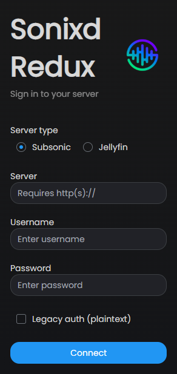
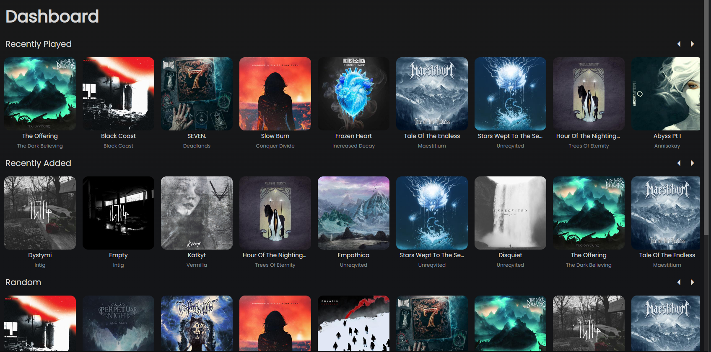

# Getting Started

## Installation

Download the latest release for your platform from the [Releases](https://github.com/joffrey-b/Sonixd-Redux/releases) page.

| Platform      | Format                 |
| ------------- | ---------------------- |
| Windows x64   | `.exe` installer       |
| macOS x64/arm | `.dmg`                 |
| Linux x64/arm | `.AppImage`, `.tar.xz` |

Run the installer and launch Sonixd Redux. On first launch you will be greeted by the login screen.

---

## Connecting to your server

Sonixd Redux supports two server types:

- **Subsonic** - compatible with Navidrome, Airsonic, Gonic, and any Subsonic-API server
- **Jellyfin** - native Jellyfin API support

1. Select your **Server type** (Subsonic or Jellyfin)
2. Enter your **Server URL** - include `http://` or `https://`, e.g. `https://music.example.com`
3. Enter your **Username** and **Password**
4. Click **Connect**

> **Subsonic users:** if your server uses plaintext authentication (older setups), enable **Legacy auth (plaintext)** before connecting.

Once connected, Sonixd Redux loads your library and takes you to the dashboard.

---

## Sidebar navigation

The sidebar on the left gives you access to all sections of your library:

| Section     | Description                        |
| ----------- | ---------------------------------- |
| Dashboard   | Recently added and most played     |
| Now Playing | Current queue                      |
| Favorites   | Starred albums, artists and tracks |
| Songs       | Full song library                  |
| Albums      | Album library with grid/list view  |
| Artists     | Artist library                     |
| Genres      | Browse by genre                    |
| Folders     | Browse by folder structure         |
| Playlists   | Your playlists                     |
| Config      | Settings                           |

You can customize which sections appear in the sidebar in **Settings → Look & Feel → Sidebar**.

---

## Disconnecting

To switch server or account, click the **Disconnect** button in the top-right corner of the Settings page.
