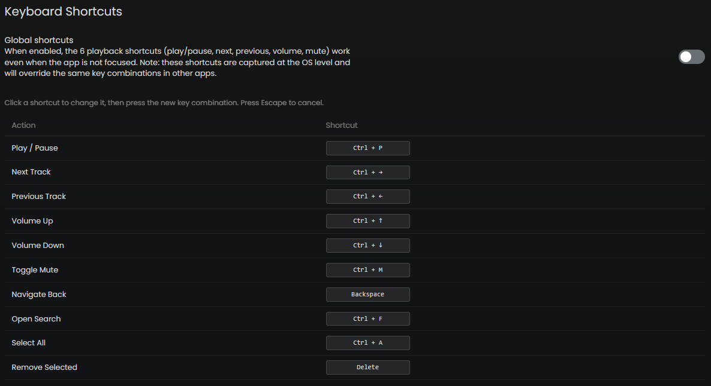

# Keyboard Shortcuts

Sonixd Redux supports fully customizable keyboard shortcuts for common actions.

---

## Default shortcuts

| Action          | Default shortcut |
| --------------- | ---------------- |
| Play / Pause    | `Ctrl + P`       |
| Next track      | `Ctrl + →`       |
| Previous track  | `Ctrl + ←`       |
| Volume up       | `Ctrl + ↑`       |
| Volume down     | `Ctrl + ↓`       |
| Mute            | `Ctrl + M`       |
| Search          | `Ctrl + F`       |
| Select all      | `Ctrl + A`       |
| Remove selected | `Del`            |
| Navigate back   | `Backspace`      |

---

## Customizing shortcuts

Go to **Settings → Keyboard Shortcuts**.

1. Click any shortcut in the list to start editing it
2. Press the new key combination you want to assign
3. Press **Escape** to cancel without saving

---

## Global shortcuts

When **Global Shortcuts** is enabled (Settings → Player), the 6 playback shortcuts (play/pause, next, previous, volume up/down, mute) work even when the Sonixd Redux window is not focused - they are captured at the OS level.

> **Note:** Global shortcuts may conflict with other applications using the same key combinations. If you experience conflicts, either disable global shortcuts or reassign the keys.

> **macOS users:** You may need to add Sonixd Redux as a trusted accessibility client in System Preferences for global shortcuts to work.

---

## Media keys

If your keyboard has dedicated media keys (play/pause, next, previous), they work out of the box via the system media transport controls without any configuration needed.
