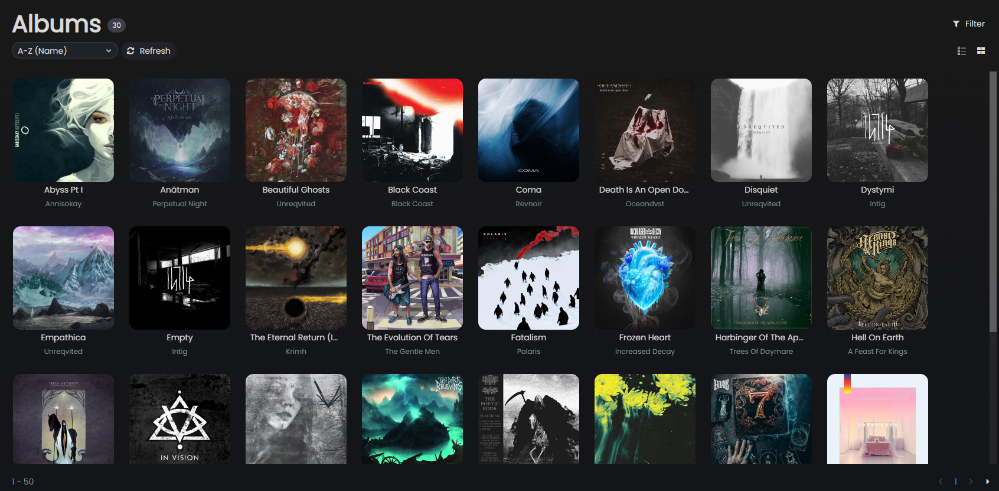
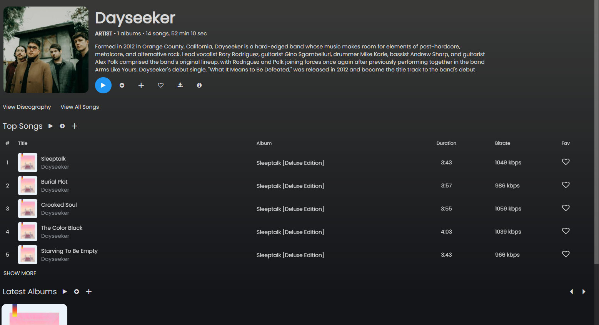
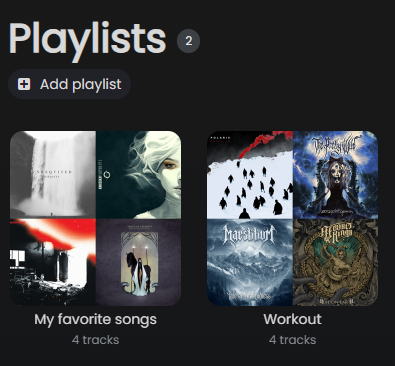

# Library

Sonixd Redux displays your server's music library across several views, accessible from the sidebar.

---

## Albums

Browse your albums in list or grid view.

- Switch between **Grid** and **List** view using the toggle in the top-right
- Sort by name, artist, year, recently added, most played, etc.
- Click an album to open it and see its tracks
- Right-click for context menu options (play, add to queue, favorite)

### Advanced filters (Albums)

The album list supports advanced filtering by genre, artist, year range, and starred status.

---

## Artists

Browse by artist. Click an artist to see their albums and top tracks.

---

## Songs

Full flat list of all songs in your library. Supports sorting by title, album, artist, duration, bitrate, play count, and more.

---

## Genres

Browse your library organized by genre. Click a genre to see its albums and songs.

---

## Folders

Browse your library by the folder structure on your server - useful if your music is organized by folder rather than tags.

---

## Playlists

View and manage your server-side playlists.

- Click a playlist to view its tracks
- Right-click tracks to add/remove them
- Create new playlists using the **Add** button at the top of the playlist list

---

## Favorites

Songs, albums, and artists you have starred. Click the ❤ icon on any item to star it.

---

## Search

Use the search bar at the top to search across your entire library. Results are grouped by songs, albums, and artists.

---

## Media folder filtering

If your server has multiple media folders (e.g. separate libraries for music and audiobooks), you can filter the library to a specific folder in **Settings → Server**.

---

## Pagination

For large libraries, album and song lists support server-side pagination. Configure the number of items per page in **Settings → Look & Feel → Pagination**.
