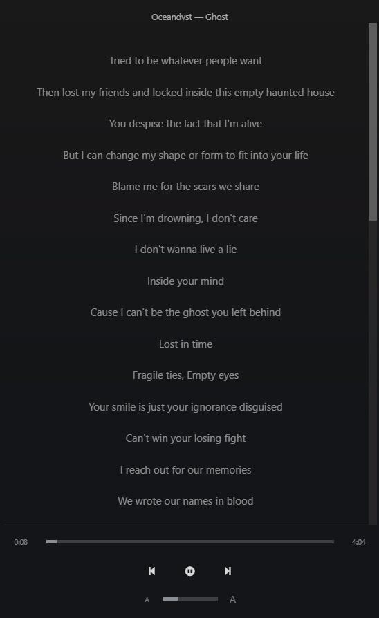
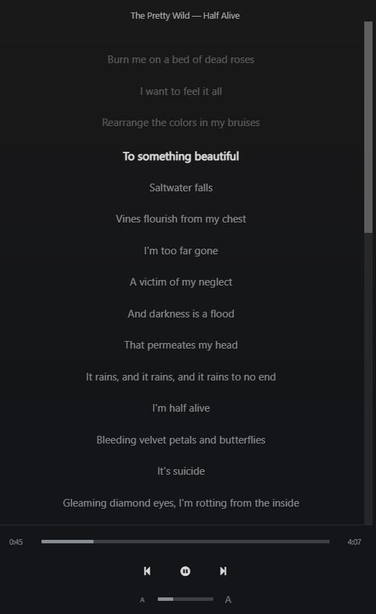

# Lyrics

Sonixd Redux can display lyrics for the currently playing track, fetched from your server.

---

## Opening the lyrics view

Click the **Lyrics** button in the player bar to open the lyrics panel.

The panel shows:

- **Artist** and **track title** at the top
- The full lyrics below

---

## Synced lyrics

If your server provides synced lyrics (LRC format), the current line is highlighted as the song plays. Click any line to seek directly to that position in the track.

---

## Zoom

Use the **zoom** control in the lyrics panel to increase or decrease the font size for readability.

---

## Availability

Lyrics availability depends on your server:

- **Navidrome** - supports synced and unsynced lyrics if your files have a sidecar LRC or TXT file
- **Jellyfin** - supports lyrics via plugins or embedded metadata
