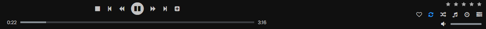
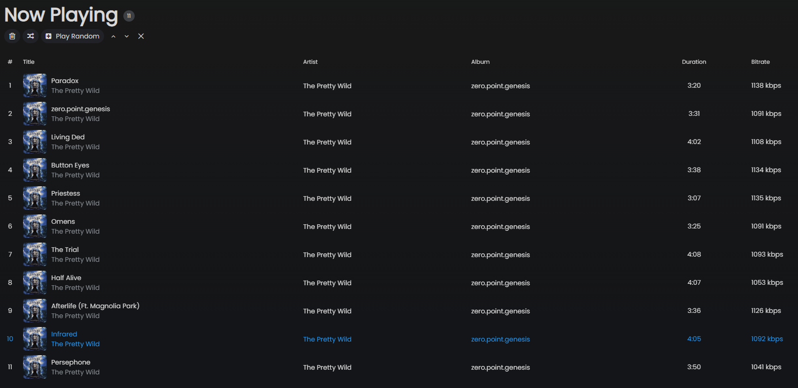
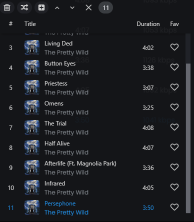

# Playback

## Player controls

The player bar sits at the bottom of the window at all times.

| Control             | Description                                                                                        |
| ------------------- | -------------------------------------------------------------------------------------------------- |
| Stop                | Stops playback and return to the beginning of the track                                            |
| Previous            | Goes to previous track (restarts current if >5s in, or go directly to previous song, configurable) |
| Seek back arrows    | Seeks back (custom time can be defined in settings)                                                |
| Play / Pause        | Toggles playback                                                                                   |
| Seek forward arrows | Seeks forward (custom time can be defined in settings)                                             |
| Next                | Skips to next track                                                                                |
| Play random         | Replaces the queue with random songs                                                               |
| Seek bar            | Click or drag the progress bar to seek                                                             |
| Favorite            | Click on the ❤ icon to add the current playing song to favorites                                   |
| Repeat              | Cycles through Off → Repeat All → Repeat One                                                       |
| Shuffle             | Randomizes the queue                                                                               |
| Jukebox mode        | Enables jukebox mode for servers that support it                                                   |
| Sleep timer         | Opens the sleep timer menu where you can set a duration after which playback stops                 |
| Mini player         | Shows the current playing queue from anywhere                                                      |
| Volume              | Drags the volume slider or scroll with the mouse wheel                                             |
| Mute                | Toggles mute                                                                                       |
| Star rating         | Lets you rate the current song from 1-star to 5-star                                               |

---

## Playing music

**Double-click** any song in a list to play it immediately and replace the current queue.

**Right-click** any song, album, or artist for the context menu with options to:

- Play now (replaces queue)
- Add to queue (next / later)
- Add to playlist
- Add to favorites
- Show the song's spectrogram

---

## Queue management

Click **Now Playing** in the sidebar to see the current queue.

- **Drag and drop** rows to reorder tracks by dragging the track number on the very left (it shows a pick hand cursor and changes the number with a logo)
- **Right-click** for per-track options
- **Shuffle queue** - randomizes the remaining tracks
- **Clear queue** - removes all tracks
- **Arrows** - let you move the selected track(s) up and down by one row

### Play Next vs Play Later

- **Add (next)** - inserts the track right after the currently playing one
- **Add (later)** - appends the track at the end of the queue

When **Preserve Play Next Order** is enabled (Settings → Player), tracks added via "Play Next" are queued in the order they were added rather than each one jumping to the top. You can change it if you want play **next** to be literal.

---

## Repeat modes

| Mode       | Behaviour                 |
| ---------- | ------------------------- |
| Off        | Stop after the last track |
| Repeat All | Loop the entire queue     |
| Repeat One | Loop the current track    |

---

## Stop after current

Tick the **Stop after current** box in the sleep timer menu to finish the currently playing track and then pause. The box is checked when active and resets automatically after stopping.

---

## Mini queue panel

Click the **Mini** button (the list icon) in the player bar to show a small queue panel in the bottom-right corner of the window. This gives you quick access to the current queue without navigating away from your current view.

