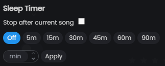

# Sleep Timer

The sleep timer automatically stops playback after a set duration - useful for falling asleep to music.

---

## Setting the timer

Click the **clock** icon in the player bar to open the sleep timer popup.

The popup has two sections:

### Stop after current song

Tick **Stop after current song** to finish the currently playing track and then stop. This resets automatically once playback stops.

### Timed stop

Choose a preset duration or enter a custom number of minutes:

| Preset | Duration   |
| ------ | ---------- |
| 5m     | 5 minutes  |
| 15m    | 15 minutes |
| 30m    | 30 minutes |
| 45m    | 45 minutes |
| 60m    | 1 hour     |
| 90m    | 90 minutes |

To set a custom duration, enter a number in the minutes field and click **Apply**.

While the timer is running, the remaining time is shown below the clock icon. Click the icon again and select **Off** to cancel.

When the timer reaches zero, playback pauses.
