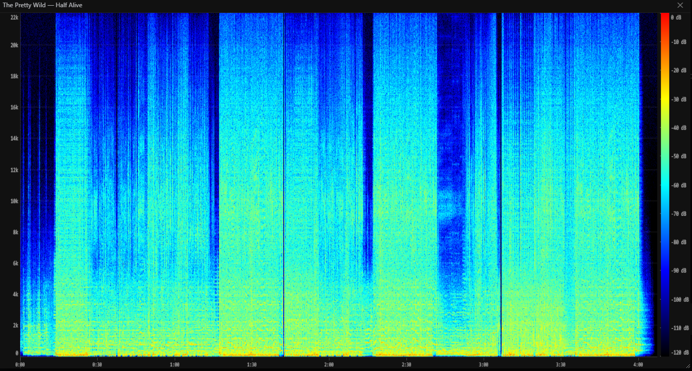

# Spectrogram

The spectrogram viewer lets you see the full frequency content of any song as a colour plot - useful for checking audio quality, identifying encoding artefacts, or just exploring what a track looks like.

---

## Opening the spectrogram

Right-click any song in any list view and select **Show spectrogram** from the context menu.

Sonixd Redux downloads the full audio file from your server and analyses it locally. While the analysis runs, the modal shows **"Analyzing audio..."** - this typically takes a few seconds depending on track length and your server speed.

---

## Reading the display

The spectrogram maps three dimensions onto the canvas:

| Axis       | What it represents                       |
| ---------- | ---------------------------------------- |
| Horizontal | Time (left = start, right = end)         |
| Vertical   | Frequency (bottom = 0 Hz, top = nyquist) |
| Colour     | Loudness at that frequency and time      |

### Colour scale

The colour runs from black → blue → cyan → green → yellow → red, covering a range of **-120 dB to 0 dB**:

| Colour       | Level                 |
| ------------ | --------------------- |
| Black        | Silence (≤ -120 dB)   |
| Blue         | Very quiet            |
| Cyan / Green | Moderate              |
| Yellow       | Loud                  |
| Red          | Very loud (near 0 dB) |

A reference gradient bar with dB labels is shown on the right side of the plot.

### Axes

- **Frequency axis (left)** - linear scale from 0 Hz at the bottom to the track's Nyquist frequency at the top (typically 22 kHz for 44.1 kHz audio). Grid lines and labels mark every 2–5 kHz depending on the sample rate.
- **Time axis (bottom)** - labelled in M:SS format with tick marks every 15–120 seconds depending on track length.

---

## Interpreting the spectrogram

A few things to look for:

- **Hard cutoff at a low frequency** (e.g. everything above 16 kHz is black) - the audio was likely transcoded from a lossy format like MP3 at a low bitrate.
- **Broad energy across the full spectrum** - uncompressed or high-bitrate audio with no cutoff.
- **Horizontal banding** - harmonic content, common in vocals and instruments with a clear pitch.
- **Vertical streaks** - transients such as drum hits or clicks.

---

## Window controls

- **Resize** - drag the bottom-right corner to make the window larger or smaller.
- **Close** - click the **✕** button or click anywhere outside the modal.
